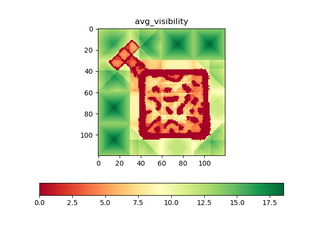

# jackal-map-creation

## Step 1 - read pointcloud from a `.ply` file

Maybe you should make some modify about map resolution, map height, map width and the coordination of origin.

`python3 read_ply.py`

Then, it would generate a `.npy` file.

## Step 2 - difficulty visualization

`python easy_plot.py`

This repo contains the code used to generate the dataset
for the [Benchmarking Metric Ground Navigation](https://arxiv.org/pdf/2008.13315.pdf) paper and can be modified
to generate new datasets for robots of different footprints.

## Requirements
* Python 2
* NumPy
* Matplotlib

## Using this repository
After cloning this repository onto your computer, create a folder called "test_data" in the same directory. Inside the test_data folder, create folders called cspace_files, grid_files, map_files, world_files, metrics_files, norm_metrics_files, and path_files.

### Generating a sample world
Run gen_world_ca.py in Python 2. This will generate a 30x30 world by cellular automaton, using an initial fill percent of 0.2 and 4 smoothing iterations.
The script will generate a path through this world and calculate difficulty metrics along this path. After this, it will save the metrics and representations of the world and path into the test_data folder. The sample world file names will be suffixed with "-1". This script can be modified to display the world, C-space, path, and the calculated metrics by uncommenting lines 683-693. To try out different generation parameters (rows, columns, fill percent, iterations), uncomment lines 569-573.

### Generating a new dataset
Run generator.py in Python 2. This will generate 300 worlds with dimensions 30x30 using 12 different sets of cellular automaton parameters. These parameters can be changed within the generator.py script.
If you change the dimensions or radius of the cylinders, update the .yaml files or `yaml_writer.py` to reflect the new `resolution`, which is the diameter of each obstacle, as well as the `origin`, whose current value of 4.5 will need to change to `-1 * number of rows * diameter of cylinders`.
Once all the environments are generated, use normalize_metrics.py to normalize the values of the calculated metrics. This script will generate 300 more files with the normalized metric values in the norm_metrics_files folder.

## BARN Dataset structure
The dataset files will be saved in the test_data folder. The folder called cspace_files contains .npy files with a 30x30 occupancy grid of the C-space. The grid_files folder will contain the occupancy grid of the world in .npy format. The map_files folder contains pgm and yaml files for use with ROS map_server. The
world_files folder contains .world files for use in Gazebo simulations. The metrics_files folder contains the 5 difficulty metrics calculated on the path in this order: distance to closest obstacle, average visibility, dispersion, characteristic dimension, and tortuosity.
The path_files folder contains the path through the world, in .npy format. The path is represented by an nx2 array, where n is the number of points in the path. Points are represented by their row and column, in that order.

The [jackal_timer repository](https://github.com/dperille/jackal_timer) can be used to run simulation trials on the dataset.
